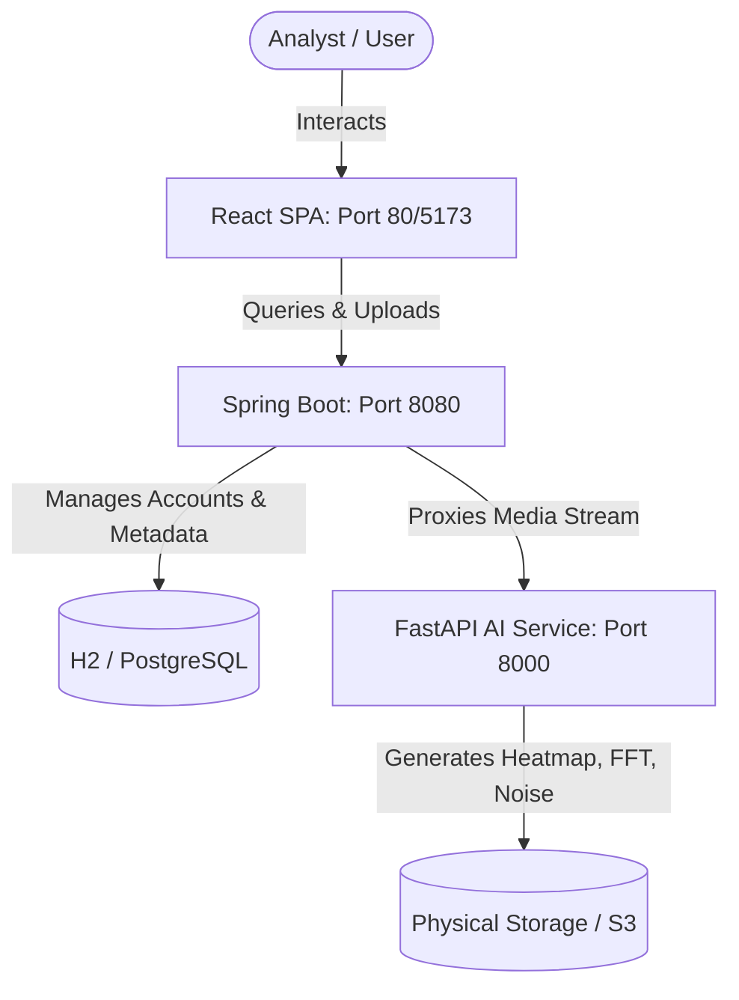
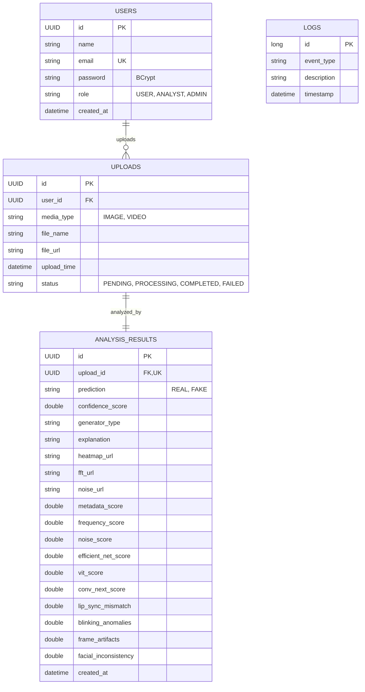

# DeepShield X 🛡️
### AI Media Authenticity & Deepfake Detection Platform

DeepShield X is a full-stack production-ready hybrid forensic media verification platform designed to flag AI-generated images, manipulated media, and deepfake videos. It integrates a **Java Spring Boot backend**, a **Python FastAPI AI forensics engine**, and a high-fidelity **React frontend** styled with modern Vanilla CSS.

---

## 🏗️ System Architecture



---

## 📁 Repository Directory Structure

```text
DeepShield X/
├── docker-compose.yml       # Production/Staging Docker multi-container orchestrator
├── read.md                  # This documentation file
├── ai_engine/               # Python FastAPI Forensics Core
│   ├── Dockerfile           # AI Engine containerization
│   ├── main.py              # API router and CORS setups
│   ├── requirements.txt     # Python scientific & web packages
│   ├── forensics_engine.py  # FFT, EXIF parsing, noise residual, and heatmap overlays
│   └── static/forensics/    # Directory where generated PNG overlays are saved
├── backend/                 # Spring Boot Orchestrator App
│   ├── Dockerfile           # Java build and execute file
│   ├── pom.xml              # Maven dependencies file
│   └── src/main/
│       ├── java/com/deepshield/backend/
│       │   ├── BackendApplication.java
│       │   ├── config/      # JWT provider, filter filters, and Cors configurations
│       │   ├── controller/  # Auth, Upload, Result, Dashboard, Admin Rest API endpoints
│       │   ├── model/       # User, Upload, AnalysisResult, Log JPA database schemas
│       │   ├── repository/  # Database access interfaces
│       │   └── service/     # Business logic, HTTP clients, and stats aggregation
│       └── resources/
│           └── application.yml  # Development (H2) and Production (PostgreSQL) profiles
└── frontend/                # Vite React Single Page Application
    ├── Dockerfile           # Node build and Nginx serve stages
    ├── package.json         # Node scripts & dependencies
    ├── index.html           # SPA entry point
    └── src/
        ├── App.jsx          # Sidebar layout, router context, and navigation
        ├── index.css        # Vanilla CSS Design System tokens, animations, and typography
        ├── components/
        │   ├── AuthView.jsx        # Dual-mode sliding login/register card
        │   ├── DashboardView.jsx   # SVG upload lines, counters, and share distribution
        │   ├── UploadZone.jsx      # Drag-drop file area with scanning lasers
        │   ├── HeatmapSlider.jsx   # Side-by-side split slider comparison
        │   ├── ReportView.jsx      # Details breakdown, FFT circles, and EXIF sheets
        │   └── AdminPanel.jsx      # Scrolling security terminal stream & accounts table
```

---

## 🔒 Relational Database Schema



---

## 🛰️ REST API Documentation

### 1. Authentication Module
* **Register Account**
  * `POST /api/auth/register`
  * Body: `{"name": "Miller", "email": "m@shield.io", "password": "pass", "role": "ANALYST"}`
* **Login Session**
  * `POST /api/auth/login`
  * Body: `{"email": "m@shield.io", "password": "pass"}`
  * Response: Returns user detail records and a signed access `token` JWT string.
* **Logout Profile**
  * `POST /api/auth/logout`

### 2. Media Upload & Serving
* **Upload Image File**
  * `POST /api/upload/image` (Multipart `file`)
* **Upload Video File**
  * `POST /api/upload/video` (Multipart `file`)
* **Retrieve Media File**
  * `GET /api/upload/files/{filename}`

### 3. Forensic Result Telemetry
* **Check Forensic Analysis Verdict**
  * `GET /api/result/{uploadId}`
  * Note: Leverages lazy loading. If the upload states are `PENDING`, this endpoint automatically queries the FastAPI AI engine, parses raw statistics, stores results in database tables, and marks the upload as `COMPLETED`.
* **Audit History Logs**
  * `GET /api/history`
  * Returns user's processed media catalog enriched with classification predictions and match percentages.

### 4. Administrative & Telemetry Analytics
* **Dashboard Summary Stats**
  * `GET /api/dashboard/stats`
* **Accounts Directory (Admin clearance only)**
  * `GET /api/admin/users`
* **Security Audit Trail (Admin clearance only)**
  * `GET /api/admin/logs`

---

## 🚀 Execution & Setup Instructions

### Option A: Zero-Setup Local Running (Recommended for Development)

Ensure you have **Node.js 18+**, **Python 3.10+**, and **Java JDK 17** installed on your host system.

#### 1. Boot Python FastAPI AI engine:
```bash
cd ai_engine
pip install -r requirements.txt
python main.py
# The server will start on http://localhost:8000
```

#### 2. Boot Spring Boot backend (Starts an in-memory H2 database by default):
```bash
cd backend
# Windows command shell:
mvnw.cmd spring-boot:run
# Linux terminal:
./mvnw spring-boot:run
# The server will start on http://localhost:8080
# H2 console is available at http://localhost:8080/h2-console
```

#### 3. Run React frontend app:
```bash
cd frontend
npm run dev
# The client interface will start on http://localhost:5173
```

---

### Option B: Cloud-Native Container Run (Docker Compose)

Simply run the following command in the root folder of the project to build and start PostgreSQL, FastAPI, Spring Boot, and Nginx React containers:

```bash
docker-compose up --build
# Open http://localhost in your browser to access the complete application
```

---

## 🧪 Forensic Testing Instructions

To test predictions inside the local workspace:
1. **Camera Photos**: Upload a standard camera JPEG. The platform will read EXIF model/make tags, calculate standard 2D FFT graphs, and display a `REAL` verdict with low anomaly rates.
2. **AI Generative Images**: Upload files containing names like `flux`, `midjourney`, or `sd`. The platform will identify missing EXIF tags, detect high-frequency grid artifacts using the FFT sensor analyzer, overlay an anomaly spatial heatmap, and classify it as `FAKE`.
3. **Deepfake Videos**: Upload videos with `deepfake` or `fake` in the file name. The system's temporal analyzer will detect eye-blinking anomalies, face frame inconsistencies, and flag the video with a high `FAKE` confidence rating.
